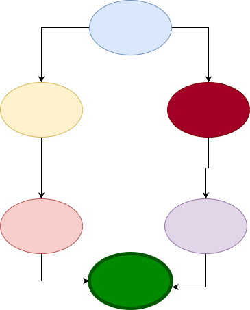

# Modification des actions
* les tuiles animaux deviennent des tuiles actions `action`
* on joue les actions `x` fois, x étant un multiplicateur
* les actions sont:
1. augmenter de 1 sur un plateau multiplicateur
2. déplacer un animal pour heurter un obstacle
3. piocher des cartes bonus (à définir)
4. jouer des cartes
5. réduire le multiplicateur d'un joueur
6. changer les prioritées sur les obstacles

# Modifications des obstacles
* les obstacles sont maintenant recto-verso, et se retournent quand on les heurte. D'un côté des points immédiats, de l'autre des catégories (`arbre`, `rocher`, `falaise`) qui font des points en fin de partie
* 

# Ajout d'un plateau joueur
Sur ce plateau, on va trouver:
* un multiplicateur qui va indiquer combien de fois on va pouvoir faire l'action
* des pistes pour compter les catégories d'obstacle heurtées dans la partie

# Modifications sur le retournement

Au lieu d'en retourner une seule, les autres joueurs retournent deux tuiles: la même est une adjacente. dans l'exemple, si le joueur actif joue bleu, les autres joueurs vont retourner:
* bleu & rouge
**OU**
* bleu & jaune